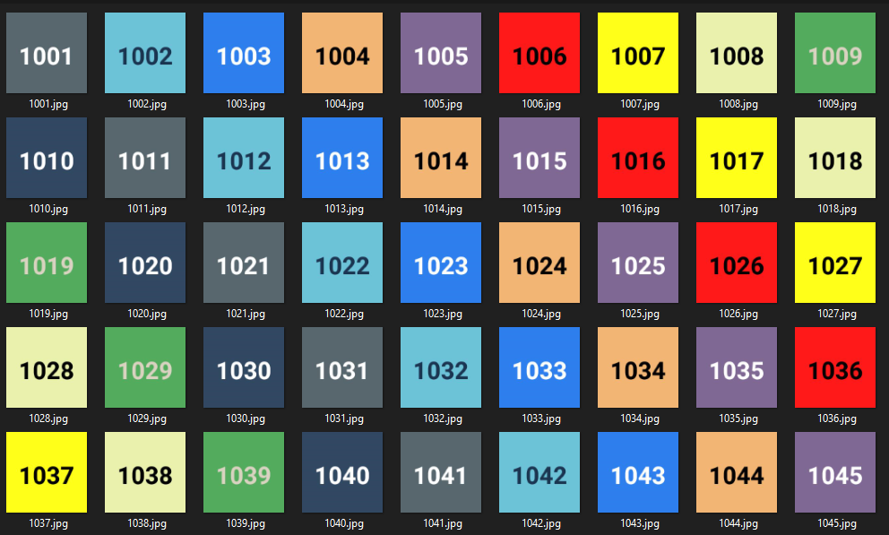
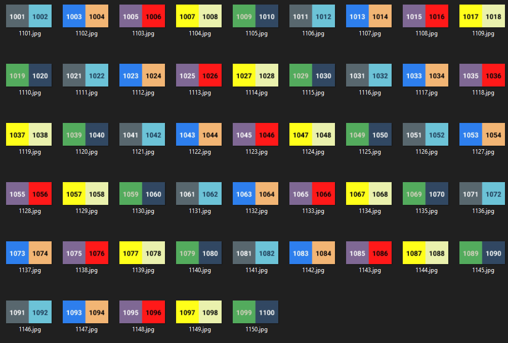

Wrote this image combiner for Dan Bock.

Parameter 1 is your Input directory. This is where your basic images should be.

Paramater 2 is your Output directory. Where you want the new things to go.

```
dothething.exe c:\temp\images\ c:\temp\output\
```

They can both be the same. Whatever.

Note that all Input directory images must be the same sizes.

Input images, for reference.



Output Images



EXE in releases created with pyinstaller.

```
pyinstaller --onefile dothething.py
```